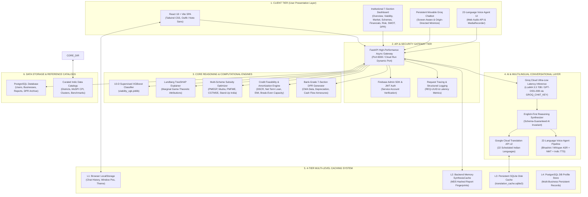
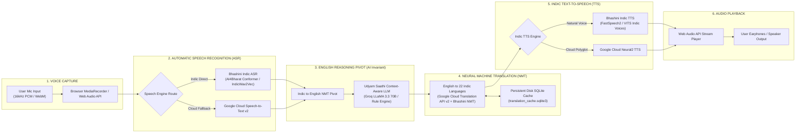
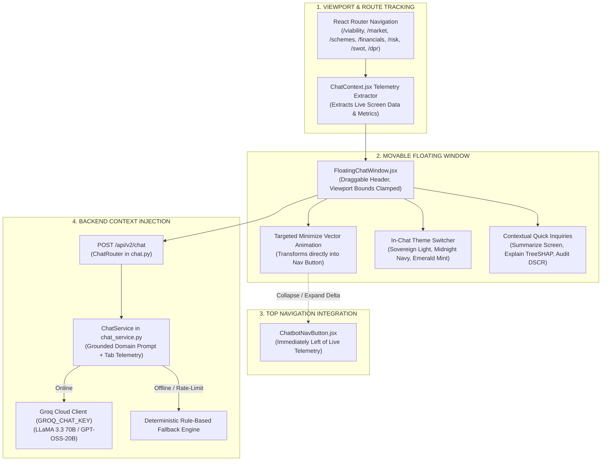
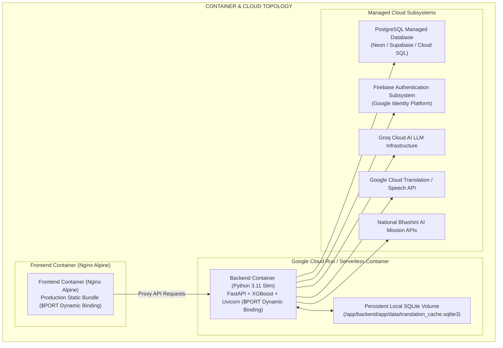

# 🇮🇳 Udyam Saathi (उद्यम साथी) — Comprehensive System Architecture

> **Smart India Hackathon 2026** • National MSME Credit Feasibility, Bank DPR Appraisal & 22-Language Voice Advisory Platform.

---

## 1. Executive Architectural Overview

**Udyam Saathi** is an institutional-grade, multi-tier enterprise credit appraisal and advisory platform designed for Indian micro, small, and medium enterprises (MSMEs). It bridges the gap between rural/semi-urban entrepreneurs and scheduled commercial banks by automating credit risk assessment, multi-scheme subsidy optimization, bankable DPR generation, real-time screen-aware chatbot advisory, and a **22-Language Indic Multilingual Voice Agent**.



---

## 2. End-to-End Data & Feasibility Pipeline

```mermaid
sequenceDiagram
    autonumber
    actor Entrepreneur as "Entrepreneur / Loan Officer"
    participant ReactUI as "React Frontend (UI/UX)"
    participant Gateway as "FastAPI Gateway (/api/v2)"
    participant ML as "XGBoost & TreeSHAP"
    participant Scheme as "Scheme Optimizer"
    participant Financial as "Financial Engine (DSCR/EMI)"
    participant GroqAI as "Groq Cloud LLM"
    participant Translation as "Google Cloud Translation / Bhashini"
    participant VoiceAgent as "22-Language Voice Pipeline"
    participant DB as "PostgreSQL & SQLite Cache"

    Entrepreneur->>ReactUI: 1. Submits 7-Step Feasibility Form (or Voice Input)
    ReactUI->>Gateway: POST /api/v2/feasibility/assess
    Gateway->>ML: 2. Compute 10-D Feature Vector
    ML-->>Gateway: Viability Score (94%), Probability & SHAP Values
    Gateway->>Scheme: 3. Evaluate Eligibility against 5 National Schemes
    Scheme-->>Gateway: Recommended Scheme (PMEGP: ₹3.75L Grant)
    Gateway->>Financial: 4. Compute 5-Yr Cash Flow, DSCR (1.78x) & EMI (₹10,240)
    Financial-->>Gateway: Financial Schedule & Break-Even Metric
    Gateway->>GroqAI: 5. Prompt Groq LLM in English (English-First Invariant)
    GroqAI-->>Gateway: Executive English Synthesis & Risk Breakdown
    Gateway->>Translation: 6. Translate to User's Indic Language (e.g. Hindi/Tamil)
    Translation<-->>DB: Query/Store in Persistent SQLite Translation Cache
    Translation-->>Gateway: Translated Multilingual Assessment Payload
    Gateway->>DB: 7. Persist Assessment & Multi-Business Record
    Gateway-->>ReactUI: Return Comprehensive Appraisal Response
    ReactUI-->>Entrepreneur: 8. Render Interactive Dashboard, Charts & Audio DPR
    opt Multilingual Voice Interaction
        Entrepreneur->>VoiceAgent: Speaks Query in Native Indic Language (e.g. Marathi / Kannada)
        VoiceAgent->>Gateway: Transcribe ASR -> Translate -> Query Chatbot -> Synthesize Indic TTS Audio
        VoiceAgent-->>Entrepreneur: Plays Natural Voice Response in User's Dialect
    end
```

---

## 3. 22-Language Multilingual Voice Agent Pipeline

Udyam Saathi incorporates a conversational **Voice Agent** supporting **all 22 Eighth Schedule Constitutional Languages of India**:

| Zone | Supported Scheduled Languages |
| :--- | :--- |
| **Northern** | Hindi (हिन्दी), Punjabi (ਪੰਜਾਬੀ), Kashmiri (کٲشُر), Dogri (डोगरी), Urdu (اردو) |
| **Western** | Marathi (मराठी), Gujarati (ગુજરાતી), Konkani (कोंकणी), Sindhi (سنڌي) |
| **Southern** | Tamil (தமிழ்), Telugu (తెలుగు), Kannada (ಕನ್ನಡ), Malayalam (മലയാളം) |
| **Eastern** | Bengali (বাংলা), Odia (ଓଡ଼ିଆ), Assamese (অসমীয়া), Maithili (मैथिली) |
| **Central / Tribal** | Sanskrit (संस्कृतम्), Santali (ᱥᱟᱱᱛᱟᱲᱤ), Bodo (बड़ो), Nepali (नेपाली), Manipuri/Meitei (মৈতৈলোন্) |



### Voice Agent Pipeline Execution Flow:
1. **Audio Capture**: Captures 16kHz PCM audio from mobile/desktop browser via Web Audio API.
2. **ASR (Speech-to-Text)**: Automatically detects spoken language from 22 Indic dialects and transcribes speech to native script.
3. **English Pivot Translation**: Translates native text into English to eliminate LLM reasoning hallucinations and ensure strict adherence to financial formulas (DSCR, CMA, MoSPI CPI).
4. **Context-Grounded LLM Reasoning**: Groq AI processes the request using real-time dashboard telemetry (active tab, loan figures, schemes).
5. **NMT Output Translation**: Translates the verified English response into the user's selected language using Google Cloud Translation API with 4-tier caching.
6. **Indic TTS Synthesis**: Synthesizes natural-sounding speech in the target language and streams high-fidelity audio back to the user.

---

## 4. 4-Tier Multi-Level Caching Subsystem

To minimize external API costs, eliminate redundant network calls, and ensure sub-100ms response times, Udyam Saathi implements a **4-Tier Hierarchical Caching Architecture**:

```mermaid
graph TD
    REQ["Incoming User / Translation Request"] --> L1{"Tier 1: Browser localStorage"}
    
    L1 -->|Hit (Instant)| L1_HIT["Return Cached UI State / History<br/>Latency: < 1ms"]
    L1 -->|Miss| L2{"Tier 2: Backend Memory Cache<br/>(SynthesisCache)"}
    
    L2 -->|Hit (Memory)| L2_HIT["Return RAM Synthesis Payload<br/>Latency: < 5ms"]
    L2 -->|Miss| L3{"Tier 3: Persistent SQLite Disk Cache<br/>(translation_cache.sqlite3)"}
    
    L3 -->|Hit (Disk SQL)| L3_HIT["Return Cached Indic Translation<br/>Latency: < 15ms"]
    L3 -->|Miss| EXT["Tier 4: External API Computation<br/>(Groq Cloud / Google Cloud Translation / PostgreSQL DB)"]
    
    EXT --> L3_WRITE["Write to Persistent SQLite Disk Cache"]
    L3_WRITE --> L2_WRITE["Store in In-Memory Synthesis RAM"]
    L2_WRITE --> L1_WRITE["Save to Browser localStorage"]
    L1_WRITE --> RESP["Deliver Fresh Response to User"]
```

---

## 5. Screen-Aware Floating Chatbot Architecture



---

## 6. Security, Deployment & DevOps Topology



---

## 7. Technology Stack Summary

| Layer | Technologies & Frameworks |
| :--- | :--- |
| **Frontend UI/UX** | React 18, Vite 5, Vanilla Tailwind CSS (Sovereign Theme Tokens), Lucide React, Canvas Confetti, Web Audio API |
| **Backend API** | FastAPI, Python 3.11, Uvicorn, Pydantic v2, HTTPX Async Client, Python-Jose |
| **Machine Learning** | XGBoost 2.0+, Lundberg TreeSHAP, Scikit-Learn, Joblib, NumPy, Pandas |
| **AI & Conversational** | Groq Cloud SDK (`GROQ_CHAT_KEY`), LLaMA 3.3 70B, GPT-OSS-20B, Deterministic Rule Fallback |
| **Multilingual & Voice** | Google Cloud Translation API v2, National Bhashini Mission APIs (ASR, NMT, Indic TTS), 22 Scheduled Indian Languages |
| **Persistence & Cache** | PostgreSQL, SQLite3 (`translation_cache.sqlite3`), In-Memory RAM Cache, Browser `localStorage` |
| **Authentication** | Firebase Admin SDK, Firebase Auth JWT Token Interceptor, Argon2 / Passlib |
| **DevOps & Containers** | Docker Multi-Stage Builds, Docker Compose, Google Cloud Run, Cloud Build, Nginx |

---
*Udyam Saathi (उद्यम साथी) • Smart India Hackathon 2026 • AI-Powered National MSME Credit Feasibility & Bank DPR Portal*
