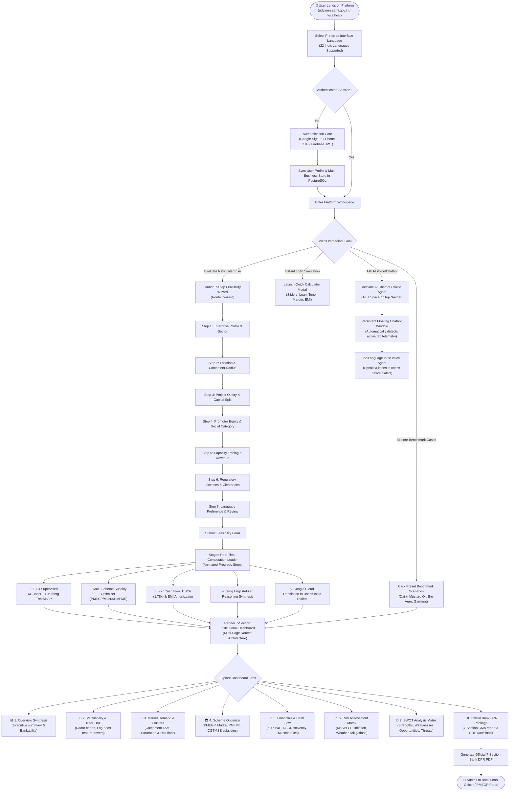
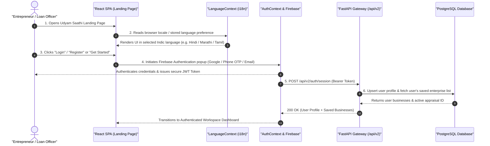
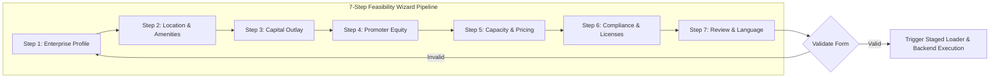
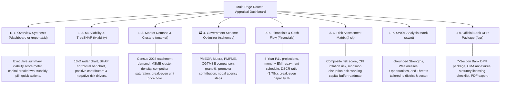
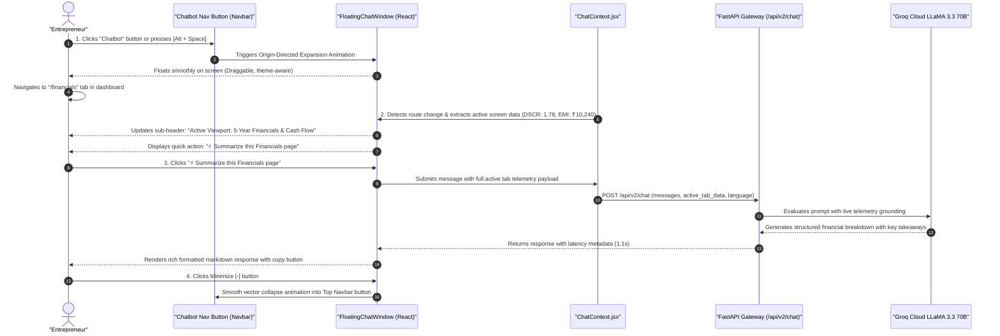
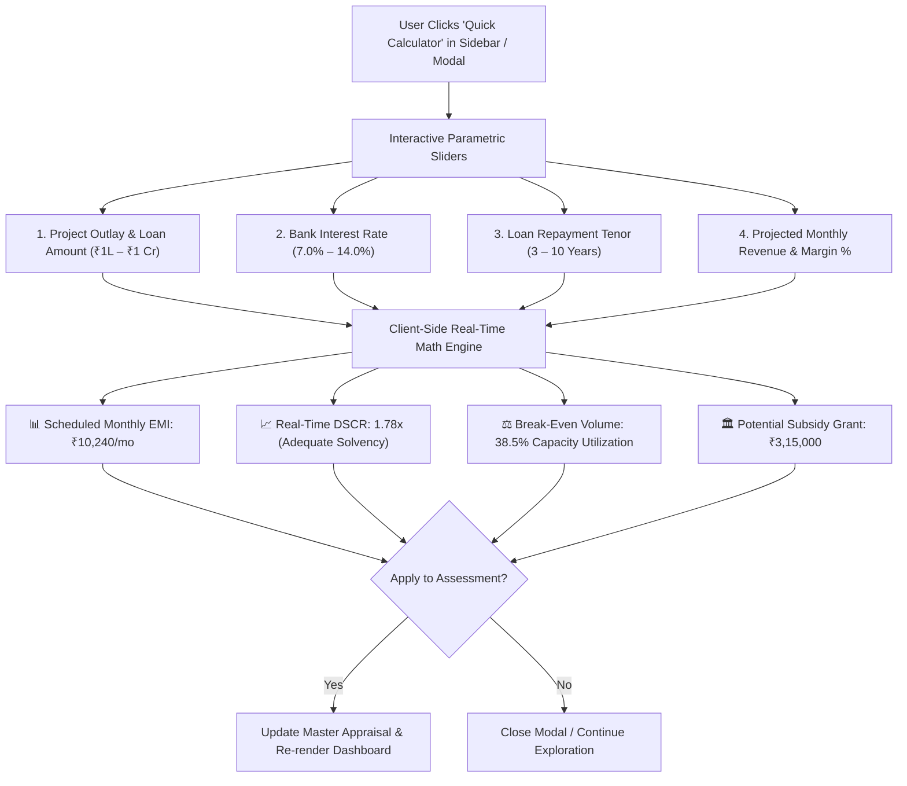
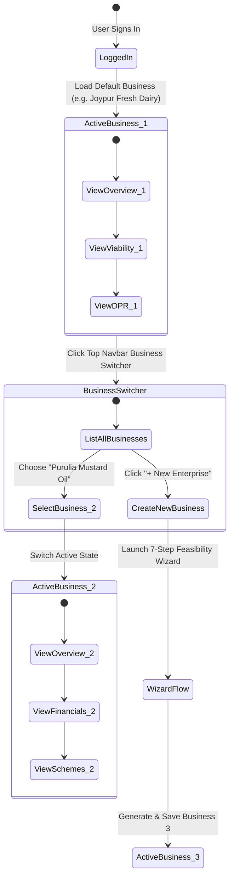
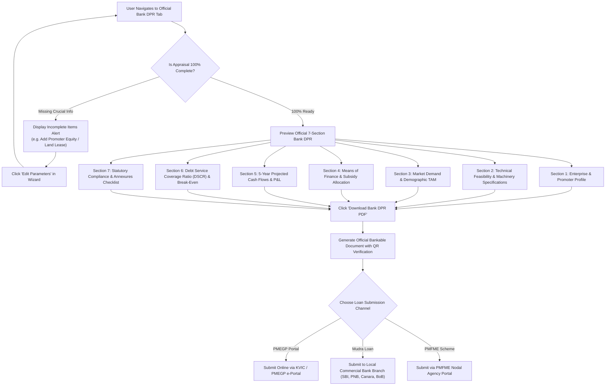

# 🇮🇳 Udyam Saathi (उद्यम साथी) — Detailed User Flow & System Interaction Architecture

> **Smart India Hackathon 2026** • Step-by-Step User Journeys, System Execution State Machine, and Interaction Diagrams.

---

## 1. Master End-to-End User Flowchart

The following diagram illustrates the complete end-to-end journey of an entrepreneur or bank loan officer interacting with the Udyam Saathi platform:



---

## 2. Phase-by-Phase User Interaction & System Response

### 🔹 Phase 1: Landing, Localization & Authentication



---

### 🔹 Phase 2: 7-Step Feasibility Assessment Wizard

The 7-Step Wizard collects domain parameters required for the **10-Dimensional Machine Learning Viability Classifier**, **MoSPI CPI inflation reconciliation**, and **Statutory Bank DPR Package**:

| Step | Form Screen | User Inputs | Real-Time Validation & Helpers |
| :---: | :--- | :--- | :--- |
| **1** | **Enterprise Profile** | Enterprise Name, Sector (Agro, Manufacturing, Services, Retail), Business Activity, Organization Type (Proprietorship, Partnership, Pvt Ltd). | Auto-suggests relevant NIC-2008 4-digit activity codes. |
| **2** | **Location & Catchment** | State, District, Block, Village/Town, Infrastructure Readiness Rating (Roads, Power, Water, Haat access). | Dynamic cascading dropdowns based on Census 2011 district master catalog. |
| **3** | **Project Outlay** | Land & Civil Works, Plant & Machinery, Working Capital Liquid Reserve, Contingency Buffer. | Live auto-sum of **Total Project Outlay** (Capex + Opex). |
| **4** | **Promoter Profile** | Social Category (General, OBC, SC/ST, Women, Ex-Servicemen), Rural vs Urban flag, Promoter Equity Margin %. | Calculates minimum required promoter equity (e.g. 5% for Special Category under PMEGP). |
| **5** | **Capacity & Pricing** | Operating Capacity (units/month), Expected Raw Material Cost per unit, Proposed Selling Price per unit. | Computes estimated annual gross turnover and unit contribution margin. |
| **6** | **Statutory & Compliance** | Existing Licenses: Udyam Registration, GSTIN, FSSAI, Pollution Control Board (CTE/CTO), Fire NOC. | Informs user which statutory clearances are mandatory for bank disbursement. |
| **7** | **Language & Review** | Preferred appraisal language (English, Hindi, Marathi, Tamil, Telugu, Kannada, etc.), Summary Review. | Comprehensive pre-flight check before initiating AI/ML inference. |



---

### 🔹 Phase 3: Staged Execution Loader & Computational Engine

When the user submits the assessment, Udyam Saathi displays an engaging staged progress loader while executing parallel micro-computations:

```mermaid
sequenceDiagram
    autonumber
    participant UI as "ReportGenerationLoader UI"
    participant Gateway as "FastAPI Gateway"
    participant XGBoost as "10-D XGBoost & TreeSHAP"
    participant SchemeEngine as "Scheme Eligibility Engine"
    participant CashFlow as "5-Year Financial Engine"
    participant GroqLLM as "Groq Cloud LLM"
    participant GoogleTranslate as "Google Cloud Translation API"
    participant SQLiteCache as "SQLite Disk Cache"

    UI->>Gateway: POST /api/v2/feasibility/assess
    Note over UI: Stage 1: "Calibrating 10-D XGBoost Viability Classifier..."
    Gateway->>XGBoost: Compute feature vector (DSCR, Infra, Density, Saturation, Weather)
    XGBoost-->>Gateway: Viability Verdict ('SUITABLE' 94%), Probabilities & SHAP values
    
    Note over UI: Stage 2: "Scanning National Subsidy Schemes (PMEGP, Mudra, PMFME)..."
    Gateway->>SchemeEngine: Evaluate social profile & outlay against national scheme rules
    SchemeEngine-->>Gateway: Matched schemes, capital subsidy grant (₹3.75L) & net loan

    Note over UI: Stage 3: "Simulating 5-Year Cash Flow, DSCR & Loan Amortization..."
    Gateway->>CashFlow: Build 60-month amortization schedule, DSCR (1.78x), Break-even volume
    CashFlow-->>Gateway: Comprehensive financial schedules & repayment tables

    Note over UI: Stage 4: "Synthesizing AI Executive Strategic Recommendations..."
    Gateway->>GroqLLM: Prompt Groq LLaMA 3.3 70B in English (English-First Invariant)
    GroqLLM-->>Gateway: Executive Synthesis, credit risks, and key strengths

    Note over UI: Stage 5: "Translating Appraisal to Selected Indic Language..."
    Gateway->>GoogleTranslate: Translate narrative synthesis to user's dialect (e.g. Marathi)
    GoogleTranslate<-->>SQLiteCache: Check/Store in SQLite persistent disk cache
    GoogleTranslate-->>Gateway: Multilingual localized appraisal payload

    Gateway-->>UI: 200 OK (Full Feasibility Appraisal Object)
    Note over UI: Confetti Celebration & Redirect to /dashboard
```

---

### 🔹 Phase 4: 7-Section Institutional Dashboard Interaction

The generated report is partitioned into **7 distinct routed pages**, providing zero-clutter institutional navigation:



---

### 🔹 Phase 5: Persistent Movable Chatbot & Real-Time Screen-Aware Interaction

The floating Chatbot utility window follows the user seamlessly across all dashboard tabs:



---

### 🔹 Phase 6: 22-Language Indic Multilingual Voice Agent Interaction

For entrepreneurs who prefer talking in their regional mother tongue:

```mermaid
sequenceDiagram
    autonumber
    actor User as "Rural Entrepreneur"
    participant VoiceUI as "Voice Agent Mic Interface"
    participant WebAudio as "Browser Web Audio API"
    participant BhashiniASR as "Indic Speech Recognition (ASR)"
    participant PivotNMT as "Indic-to-English NMT Pivot"
    participant CoreAI as "Udyam Saathi Groq AI Engine"
    participant IndicNMT as "English-to-Indic NMT"
    participant IndicTTS as "Indic Text-to-Speech (TTS)"

    User->>VoiceUI: 1. Taps Mic button and speaks in native language (e.g. Marathi: "माझ्या डेअरी व्यवसायाला किती सबसिडी मिळेल?")
    VoiceUI->>WebAudio: Captures 16kHz audio stream via MediaRecorder
    WebAudio->>BhashiniASR: Streams voice audio payload
    BhashiniASR-->>PivotNMT: Transcribes Marathi speech to native text
    PivotNMT-->>CoreAI: Translates to verified English prompt: "How much subsidy will my dairy business get under PMEGP?"
    Note over CoreAI: Injects active dairy project telemetry (₹9.00L cost, 35% PMEGP grant)
    CoreAI-->>IndicNMT: Generates exact factual response in English: "Under PMEGP, your dairy enterprise is eligible for ₹3.15 Lakhs subsidy (35%)..."
    IndicNMT-->>IndicTTS: Translates verified response to Marathi: "PMEGP योजनेअंतर्गत, तुमच्या डेअरी प्रकल्पाला ₹३.१५ लाख (३५%) सबसिडी मिळेल..."
    IndicTTS-->>VoiceUI: Synthesizes natural Marathi speech audio stream
    VoiceUI-->>User: 2. Plays clear, natural voice response in user's earphones/speaker
```



---

### 🔹 Phase 7: Interactive Quick Calculator Simulation

For instant what-if scenario testing without altering the master business record:



---

## 3. Multi-Business State Switching State Machine

Udyam Saathi allows an entrepreneur or consultant to evaluate and manage **multiple micro-enterprises** within the same authenticated account:



---

## 4. Bank DPR Generation & Loan Application Decision Tree



---

## 5. Summary of Key Interaction Rules

1. **Zero-Crash Invariant**: If external network connections or API rate limits occur at any step, Udyam Saathi seamlessly defaults to calibrated **deterministic local heuristics and pre-trained XGBoost artifacts** without breaking the user experience.
2. **Language Persistence**: When a user switches language (e.g. from English to Hindi or Tamil), the entire application — including charts, tooltips, tables, chatbot responses, and voice synthesis — updates synchronously.
3. **Screen-Aware AI Grounding**: The AI Chatbot always knows the exact dashboard screen and metrics currently in the user's viewport, providing immediate context-aware explanations on demand.

---
*Udyam Saathi (उद्यम साथी) • Smart India Hackathon 2026 • AI-Powered National MSME Credit Feasibility & Bank DPR Portal*
