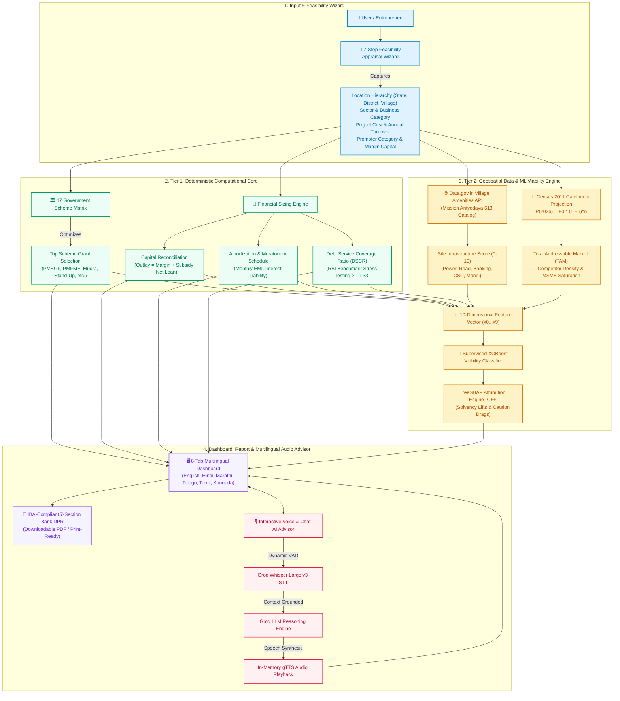
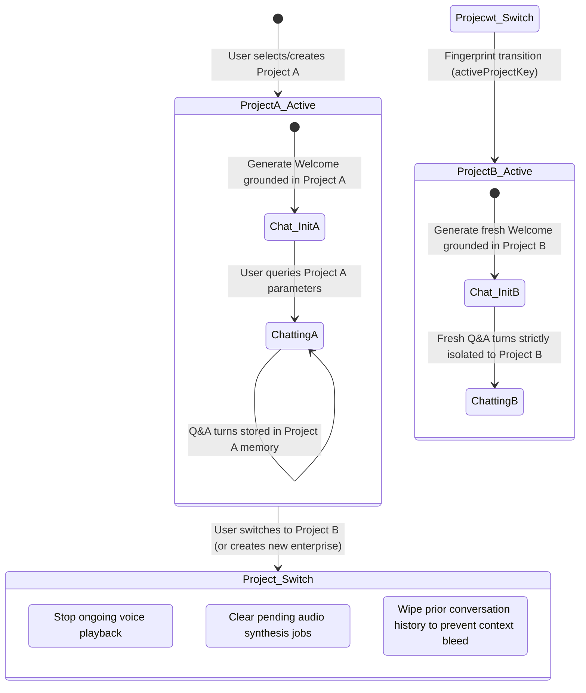

# 📊 Udyam Saathi (उद्यम साथी): System Workflow & Architecture Diagrams

---

## 1. End-to-End User Journey & Processing Workflow



---

## 2. Interactive Voice & Chatbot Telemetry Pipeline

```mermaid
sequenceDiagram
    autonumber
    actor User as 👤 Entrepreneur
    participant UI as 🖥️ Floating Chat UI (Web Audio API)
    participant VAD as 🔊 Dynamic Silence Detector
    participant API as ⚡ FastAPI Backend Router (/api/v2/chat)
    participant STT as 🎙️ Groq Whisper Large v3 (STT)
    participant ChatService as 🧠 Chatbot Reasoning Engine
    participant GroqLLM as 🤖 Groq LLM (gpt-oss-20b / llama-3.3)
    participant TTS as 🔊 gTTS Audio Engine

    User->>UI: Clicks Microphone & Speaks in Regional Language
    UI->>VAD: Stream microphone audio & monitor RMS volume
    VAD->>VAD: Detect speech onset & wait for 1.6s pause
    VAD-->>UI: Automatically stops recording on silence
    UI->>API: POST /api/v2/chat/audio (Audio Blob + Active Telemetry + Target Lang)
    
    API->>STT: Transcribe audio with forced language parameter
    STT-->>API: Accurate native transcript (e.g., Telugu / Hindi)
    
    API->>ChatService: Assemble prompt (System Rules + Active Screen Data + 10-D Metrics)
    ChatService->>GroqLLM: Generate decisive, data-grounded response
    GroqLLM-->>ChatService: Return localized response & verified data sources
    
    ChatService->>TTS: Synthesize cleaned speech text to in-memory MP3
    TTS-->>API: Base64 Audio Data URL (data:audio/mp3;base64,...)
    
    API-->>UI: JSON { transcript, reply, audio_base64, latencies }
    UI->>User: Display message bubble + Auto-play spoken voice audio
```

---

## 3. Dual-Engine Execution & Separation of Concerns

```mermaid
flowchart LR
    classDef math fill:#ecfdf5,stroke:#059669,stroke-width:2px,color:#047857;
    classDef xai fill:#fef3c7,stroke:#d97706,stroke-width:2px,color:#b45309;
    classDef genai fill:#ede9fe,stroke:#7c3aed,stroke-width:2px,color:#5b21b6;

    subgraph DeterministicEngine ["Deterministic Mathematical Core (Zero Hallucination)"]
        direction TB
        M1["Debt Amortization with Moratorium"]
        M2["17-Scheme Matching & Ranking Matrix"]
        M3["RBI Prudential DSCR Calculation"]
        M4["MoSPI CPI Inflation-Adjusted Pricing"]
    end

    subgraph ExplainableMLEngine ["Explainable Machine Learning Engine (XAI)"]
        direction TB
        X1["Mission Antyodaya 613 Infrastructure Score"]
        X2["Census 2011 Catchment Demographics"]
        X3["10-D Supervised XGBoost Classifier"]
        X4["Lundberg TreeSHAP Shapley Attribution"]
    end

    subgraph GenerativeAdvisor ["Generative AI & Audio Layer"]
        direction TB
        G1["Multilingual Speech-to-Text (Whisper)"]
        G2["Context-Grounded Advisory (Groq LLM)"]
        G3["Text-to-Speech Audio Synthesis (gTTS)"]
        G4["Executive Feasibility Narrative Synthesizer"]
    end

    DeterministicEngine -->|Injects Financial Grounding| ExplainableMLEngine
    DeterministicEngine -->|Injects Auditable Figures| GenerativeAdvisor
    ExplainableMLEngine -->|Injects Viability & SHAP Factors| GenerativeAdvisor

    class M1,M2,M3,M4 math;
    class X1,X2,X3,X4 xai;
    class G1,G2,G3,G4 genai;
```



---

## 4. Multi-Project State Lifecycle & Auto-Reset


