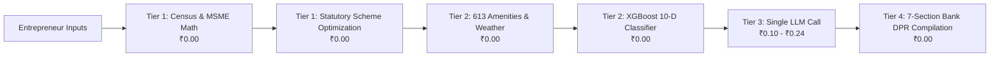
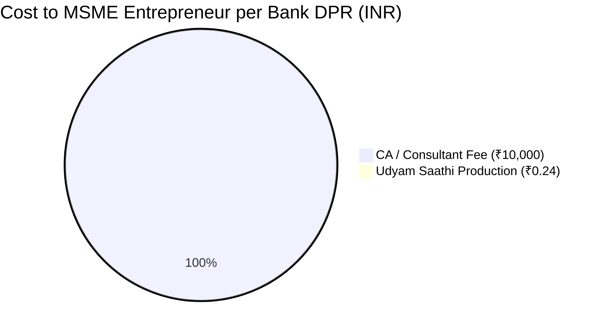

# Udyam Saathi — DPR Generation Cost & Unit Economics Report
**Document ID:** `REP-DPR-COST-2026`  
**Platform Version:** `v2.0.0` (SIH 2026 — Problem Statement 26091)  
**Date:** September 27, 2026  
**Audience:** Technical Evaluators, Jury Panels, MSME Financing Stakeholders

---

## 1. Executive Summary

In traditional banking and MSME consultancy, acquiring a bankable **Detailed Project Report (DPR)** and credit appraisal memo costs an entrepreneur **₹5,000 to ₹25,000** and takes **3 to 14 days** through Chartered Accountants (CAs) or District Industries Centre (DIC) intermediaries.

Udyam Saathi democratizes access to statutory institutional credit by automating the end-to-end 7-section bank credit dossier. Through hybrid deterministic-ML architecture, Udyam Saathi achieves:
- **Marginal Cost per DPR:** **₹0.00** (Free Developer / Hackathon tier) to **₹0.10 – ₹0.26** (Commercial Production).
- **Turnaround Latency:** **< 2.5 seconds** (compared to 7+ days manually).
- **Cost Reduction:** **> 99.99%** compared to commercial market benchmarks.



---

## 2. End-to-End Pipeline & Resource Cost Matrix

The DPR generation pipeline executes in `backend/app/routers/feasibility.py` via `_run_pipeline()`. Below is the complete cost accounting across all stages:

| Layer / Stage | Technical Sub-system | Infrastructure / API Source | Execution Cost (INR) | Execution Cost (USD) |
| :--- | :--- | :--- | :---: | :---: |
| **Tier 0: Geospatial** | Locality & Centroid Resolution | Local Gazetteer SQLite DB | **₹0.00** | $0.00 |
| **Tier 1: Demographics** | Catchment Population & TAM | `census_raw` (660k+ village rows) | **₹0.00** | $0.00 |
| **Tier 1: MSME Density** | Enterprise Density & Competition | `msme_district` (788 district rows) | **₹0.00** | $0.00 |
| **Tier 1: Financials** | Amortization, DSCR, BEP, ROI | Deterministic Banking Math Engine | **₹0.00** | $0.00 |
| **Tier 1: Scheme Engine** | PMEGP, PMFME, MUDRA, Stand-Up | `government_schemes.json` Rules | **₹0.00** | $0.00 |
| **Tier 2: Amenities** | 613 Village Amenities Score | Data.gov.in Open Data API / Local Fallback | **₹0.00** | $0.00 |
| **Tier 2: Macro Factors** | State CPI Inflation & Weather Risk | MoSPI / IMD DB lookup | **₹0.00** | $0.00 |
| **Tier 2: ML Viability** | 10-D Viability Classifier | `viability_xgb.joblib` (Local CPU, <5ms) | **₹0.00** | $0.00 |
| **Tier 3: AI Synthesis** | Executive Summary & Grounded SWOT | Single LLM Call (Groq / Sarvam AI) | **₹0.10 – ₹0.26** | $0.0012 – $0.0031 |
| **Tier 3: Translation** | Regional Indian Language Translation | Google Cloud Translation (500k free chars/mo) | **₹0.00** | $0.00 |
| **Tier 4: Bank DPR** | 7-Section Bank Memorandum | In-memory Pydantic / Markdown / HTML | **₹0.00** | $0.00 |
| **Total Pipeline** | **End-to-End DPR Generation** | **Hybrid Architecture** | **~₹0.10 – ₹0.26** | **~$0.0012 – $0.0031** |

---

## 3. Tier 3 AI Synthesis: Deep Token & Billing Economics

To prevent compounding API costs and ensure deterministic auditability, the system enforces the **Single LLM Call Guarantee**:
1. Zero financial calculations are performed by the LLM (eliminating hallucinations).
2. All ₹ outlay, debt service ratios, subsidy grants, and ML probabilities are injected as immutable facts into one single prompt.
3. The LLM generates the credit memo narrative and tailored SWOT in English.

### Token Volume Accounting

| Prompt Component | Token Count | Character Count | Description |
| :--- | :---: | :---: | :--- |
| **System Prompt** | ~350 tokens | ~1,800 chars | Strict underwriting invariants, JSON response schema |
| **User Context & Metrics** | ~450 tokens | ~2,300 chars | Enterprise profile, pre-calculated EMI, DSCR, subsidies, ML scores |
| **Total Prompt (Input)** | **~800 tokens** | **~4,100 chars** | **Cached or fed to inference engine** |
| **LLM Output (Completion)** | **~900 tokens** | **~4,600 chars** | 2-para executive summary, 4 recommendations, bank memo, 4-quadrant SWOT |
| **Total Generation Footprint** | **~1,700 tokens** | **~8,700 chars** | **Single request lifecycle** |

### Provider Price Comparison (1 DPR)

```
LLM Option                 Cost (INR)      Latency      Availability
-----------------------------------------------------------------------------------
Groq Free Tier             ₹0.00           < 1.0s       Active (14,400 req/day limit)
Groq Llama 3.1 8B          ₹0.009          < 0.8s       Commercial Pay-as-you-go
Groq Llama 3.3 70B         ₹0.098 (~₹0.10) < 1.8s       Commercial Institutional
Sarvam AI 105B             ₹0.240 (~₹0.24) < 2.5s       Sovereign Indian LLM
Deterministic Template     ₹0.000          < 0.05s      Offline Zero-Cost Fallback
```

---

## 4. Multi-Lingual Translation Economics

Udyam Saathi supports **6 Indian languages** (English, Hindi, Marathi, Tamil, Telugu, Kannada):
- **Domain Dictionary & Institutional Headers:** Pre-translated into `CORE_DOMAIN_TERMS`. Fixed tables, ratios, and statutory checklists cost **₹0.00**.
- **Dynamic AI Narrative:** Only the ~3,000 characters of dynamic text are translated via Google Cloud Translation API.
- **Google Cloud Free Tier:** **First 500,000 characters every month are 100% FREE**.
  - Monthly allowance allows **~166 complete regional DPR translations at ₹0.00**.
  - Subsequent volume: $20 per 1M characters (~₹5.00 per translated DPR).
- **SQLite Deduplication Cache:** Persistent cache (`translation_cache.sqlite3`) ensures repeat phrases cost ₹0.

---

## 5. Macro Scale & Operating Budget Projections

| Monthly DPR Volume | Target Entrepreneur Reach | Free Tier Setup (Groq + GCP Free) | Production Groq 70B Setup | Production Sarvam 105B Sovereign Setup |
| :---: | :---: | :---: | :---: | :---: |
| **100 DPRs** | Prototype / Hackathon | **₹0.00** | **₹9.80** | **₹24.00** |
| **500 DPRs** | Pilot District (Pune) | **₹0.00** | **₹49.00** | **₹120.00** |
| **1,000 DPRs** | State Sub-Division | **₹0.00** | **₹98.00** | **₹240.00** |
| **10,000 DPRs** | State-Wide MSME Rollout | **₹0.00** (distr. API keys) | **₹980.00** (~$12 USD) | **₹2,400.00** (~$29 USD) |
| **100,000 DPRs** | National DIC / PMEGP Scale | N/A | **₹9,800.00** (~$118 USD) | **₹24,000.00** (~$289 USD) |

---

## 6. Industry Benchmark & ROI Comparison



| Dimension | Chartered Accountant / Private Consultant | Commercial DPR Software / Portals | Udyam Saathi Platform |
| :--- | :--- | :--- | :--- |
| **Fee to Entrepreneur** | ₹5,000 – ₹25,000 | ₹1,500 – ₹3,500 | **₹0.00 (Public Good)** |
| **Internal Cost per Report** | ~₹2,000 (man-hours) | ~₹250 (infrastructure) | **₹0.10 – ₹0.26** |
| **Generation Turnaround** | 3 to 14 Business Days | 2 to 4 Hours | **< 2.5 Seconds** |
| **Audited Ground Truth** | Manual, unverified estimates | Generic templates | **Census 2011 + MoMSME Registry + Data.gov.in** |
| **Explainable ML** | None (rule of thumb) | Static spreadsheets | **10-D XGBoost + TreeSHAP Attributions** |
| **Statutory Standards** | Varies by accountant | Generic balance sheets | **RBI PSL & DIC 7-Section Bank Appraisal** |

---

## 7. Architectural Guarantees Ensuring Low Cost

1. **SHA-256 In-Memory Payload Cache:** Identical feasibility requests within a 1-hour TTL hit memory and return in < 1ms at **₹0.00**.
2. **Local Machine Learning Execution:** The 10-dimensional XGBoost classifier runs on commodity CPU threads in Python, avoiding cloud inference GPUs entirely.
3. **Data.gov.in Circuit Breaker:** Open government APIs are invoked asynchronously with an in-memory circuit breaker, avoiding wasted server-thread holding or paid retry storms.
4. **Deterministic Multi-Lingual Fallback:** If cloud translation or LLM endpoints are unreachable, statutory template matrices generate bank-ready dossiers offline at **zero cost**.
