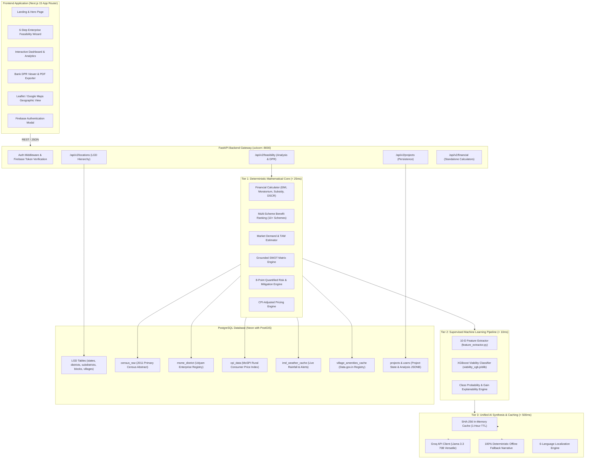
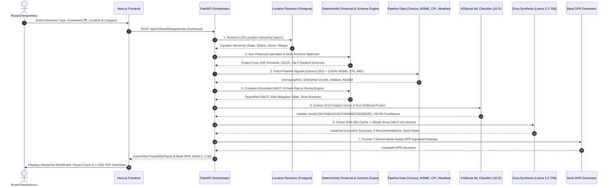
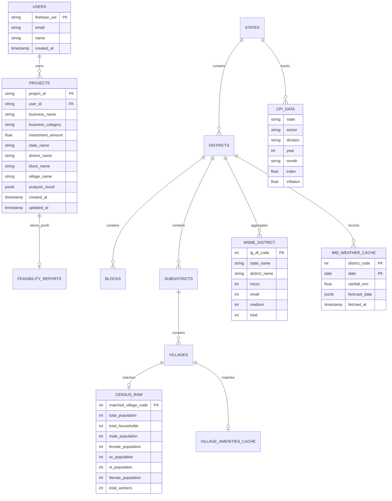

# 📐 System Architecture & Data Flow Specification

This document provides complete end-to-end technical diagrams, database entity models, and API contract specifications for the **Udyam Saathi** platform.

---

## 1. High-Level System Architecture Diagram

---

## 2. End-to-End Execution Sequence Diagram

---

## 3. Database Schema Models (Neon PostgreSQL)

---

## 4. API Endpoints Contract (v2)

| Method | Endpoint | Description | Request Body / Params | Response Model |
| :--- | :--- | :--- | :--- | :--- |
| **POST** | `/api/v2/feasibility/generate` | Run full feasibility analysis | `UserInput` JSON | `FeasibilityReport` |
| **GET** | `/api/v2/feasibility/{report_id}` | Retrieve cached feasibility report | `report_id: str` | `FeasibilityReport` |
| **GET** | `/api/v2/feasibility/{report_id}/dpr` | Get official 7-section Bank DPR | `report_id: str` | `BankDPRDocument` |
| **POST** | `/api/v2/feasibility/dpr` | Direct UserInput to DPR | `UserInput` JSON | `BankDPRDocument` |
| **GET** | `/api/v2/projects` | List authenticated user's projects | Header: `Authorization: Bearer <token>` | `List[ProjectModel]` |
| **POST** | `/api/v2/projects` | Create a new draft project | `{business_type, investment_amount, ...}` | `ProjectModel` |
| **GET** | `/api/v2/projects/{project_id}` | Get saved project & analysis | `project_id: str` | `ProjectModel` |
| **POST** | `/api/v2/projects/{project_id}/analyze` | Run analysis and save to PostgreSQL | `project_id: str` | `ProjectModel` |
| **GET** | `/api/v2/projects/{project_id}/dpr` | Retrieve persistent Bank DPR | `project_id: str` | `BankDPRDocument` |
| **GET** | `/api/v2/locations/states` | List all Indian states from LGD | None | `List[StateInfo]` |
| **GET** | `/api/v2/locations/districts` | List districts for a state | `state_code: int` | `List[DistrictInfo]` |
| **GET** | `/api/v2/locations/blocks` | List blocks for a district | `district_code: int` | `List[BlockInfo]` |
| **GET** | `/api/v2/locations/villages` | List villages for a district/block | `district_code: int, block_code: int` | `List[VillageInfo]` |
